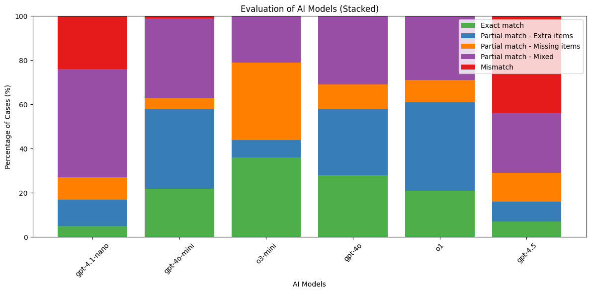

# assets-manager-start-projects-evaluation
This repository contains the code and data used to evaluate different AI models and prompting techniques for selecting relevant code snippets based on project descriptions. Selection algorithm is implemented in [assets-manager-api](https://github.com/Shchoholiev/assets-manager-api)

## Table of Contents

- [Overview](#overview)  
- [Model Selection Evaluation](#model-selection-evaluation)  
- [Prompt Engineering Evaluation](#prompt-engineering-evaluation)  
- [Results](#results)  
- [Getting Started](#getting-started)  
- [License](#license)  

## Overview

Assets manager API automatically assembles starter projects for digital banking components by selecting the most relevant code snippets based on a text description. I compared several AI models by processing 100 synthetic “projects” against a pool of 100 candidate snippets, measuring how accurately each model retrieved exactly the needed fragments.

## Model Selection Evaluation

Models are benchmarked in ascending order of cost (per 1 M in + 1 M out tokens):
1. **gpt-4.1-nano** ($0.50)  
2. **gpt-4o-mini** ($0.75)  
3. **o3-mini** ($5.50)  
4. **o1** ($75)  
5. **gpt-4o** ($12.50)  
6. **gpt-4.5** ($225)

Each model received the project description and the full snippet pool and returned its top choices. I classified outcomes into:
- **Exact match**: all and only needed snippets selected  
- **Partial – Extra**: most needed, but with extras  
- **Partial – Missing**: missed some needed  
- **Partial – Mixed**: extras and missing together  
- **Mismatch**: irrelevant selections  

## Prompt Engineering Evaluation

Using **gpt-4o-mini** as my chosen backbone, I tested three prompting styles on the same data:

1. **Zero-shot** (no examples)  
2. **Few-shot** (with example pairs)  
3. **Chain-of-Thought** (model explains reasoning then selects)

| Technique           | Exact Match |
|---------------------|------------:|
| Zero-shot           | 16%         |
| Few-shot            | 22%         |
| Chain-of-Thought    | 34%         |

Chain-of-Thought prompting achieved near the performance of much costlier models at a fraction of the price.

## Results

- **Best Model**: `gpt-4o-mini` for cost/quality trade-off  
- **Best Prompting**: Chain-of-Thought  

---

# Notes

To access API endpoints exposed by a different docker container from within a current one, use `host.docker.internal` instead of `localhost`